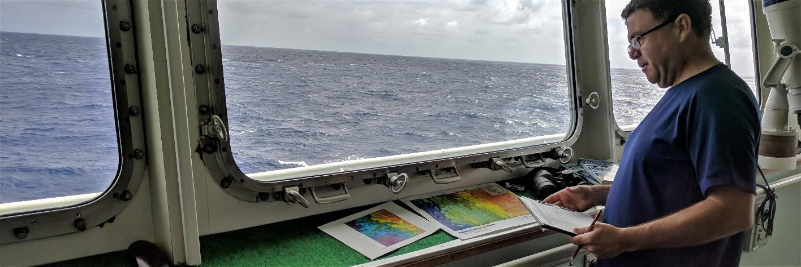

[Scott D. Foster](mailto:scott.foster@csiro.au), Jacquomo Monk, Emma Lawrence, Keith R. Hayes, Geoffrey R. Hosack, Rachel Przeslawski

Chapter citation:
Foster SD, Monk J, Lawrence E, Hayes KR, Hosack GR, Przeslawski R. 2018. Statistical considerations for monitoring and sampling. In Field Manuals for Marine Sampling to Monitor Australian Waters, Przeslawski R, Foster S (Eds). National Environmental Science Programme (NESP). pp 23-41. 
