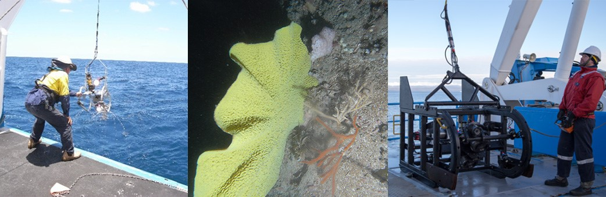

<a href="mailto:andrew.carroll@ga.gov.au">Andrew Carroll</a>, Franzis Althaus, Robin Beaman, Ariell Friedman, Daniel Ierodiaconou, Tim Ingleton, Alan Jordan, Michelle Linklater, Jacquomo Monk, Alix Post, Rachel Przeslawski, Jodie Smith, Marcus Stowar, Maggie Tran & Aaron Tyndall

 

<i>Left: Australian Institute of Marine Science; Centre: Geoscience Australia; Right: Marine National Facility.</i>
 
 
<strong>Chapter citation:</strong> Carroll A, Althaus F, Beaman R, Friedman A, Ierodiaconou D, Ingleton T, Jordan A, Linklater M, Monk J, Post A, Przeslawski R, Smith J, Stowar M, Tran M, Tyndall A. 2020. Marine sampling field manual for towed underwater camera systems. In <em>Field Manuals for Marine Sampling to Monitor Australian Waters</em>, <em>Version </em>2. Przeslawski R, Foster S (Eds). National Environmental Science Programme (NESP).

| Chapter Contents                                                                                                                     |
|--------------------------------------------------------------------------------------------------------------------------------------|
|  **[Platform Description](https://towed-imagery-field-manual.github.io/platform-description)**                                    |
|  __[Scope](https://towed-imagery-field-manual.github.io/scope)__                                                                  |
|  **[Towed Underwater Cameras in Marine Monitoring](https://towed-imagery-field-manual.github.io/towed-underwater-cameras-in-marine-monitoring)** |
|  **[Pre-Survey Preparations](https://towed-imagery-field-manual.github.io/pre-survey-preparations)**                              |
|  **[Field Procedures](https://towed-imagery-field-manual.github.io/field-procedures)**                                            |
|       _[Pre-deployment](https://towed-imagery-field-manual.github.io/field-procedures#pre-deployment)_    |
|       _[Deployment](https://towed-imagery-field-manual.github.io/field-procedures#deployment)_       |
|       _[Retrieval](https://towed-imagery-field-manual.github.io/field-procedures#retrieval)_            |
|       _[Seabed hook-up procedures](https://towed-imagery-field-manual.github.io/field-procedures#seabed-hook-up-procedures)_            |
|       _[Operation completion](https://towed-imagery-field-manual.github.io/field-procedures#operation-completion)_            |
|       _[Onboard data processing and storage](https://towed-imagery-field-manual.github.io/field-procedures#onboard-data-processing-and-storage)_            |
|  **[Post-survey Procedures](https://towed-imagery-field-manual.github.io/post-survey-procedures)**                                |
|       _[Data processing](https://towed-imagery-field-manual.github.io/post-survey-procedures#data-processing)_                    |
|       _[Annotation framework](https://towed-imagery-field-manual.github.io/post-survey-procedures#annotation-framework)_                          |
|       _[Data curation and quality control](https://towed-imagery-field-manual.github.io/post-survey-procedures#data-curation-and-quality-control)_                          |
|       _[Data release](https://towed-imagery-field-manual.github.io/post-survey-procedures#data-release)_                          |
|       _[Data analysis](https://towed-imagery-field-manual.github.io/post-survey-procedures#data-analysis)_                          |
|  **[Field Manual Maintenance](https://towed-imagery-field-manual.github.io/field-manual-maintenance)**                            |
|  **[Acknowledgements](https://towed-imagery-field-manual.github.io/acknowledgements)**                                            |
|  **[References](https://towed-imagery-field-manual.github.io/references)**                                                        |

<a href="#" class="scrollUpButton">Back to top</a>